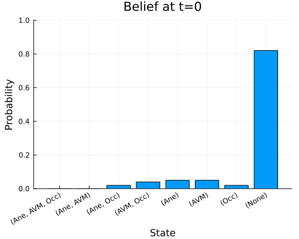

# DSAPOMDPs

This repo contains the code for the experiments of the paper ["Toward an Integrated Decision-Making Framework for Optimized Stroke Diagnosis with DSA and Treatment under Uncertainty" by Nur Ahmad Khatim, Azmul Asmar Irfan, Amaliya Mata'ul Hayah, and Mansur M. Arief](./paper/khatim2023_DSAPOMDP.pdf). 

<p align="center">
    
</p>

## Installation

To install the package, run
```julia
using Pkg
pkg"add https://github.com/inteligensi/DSAPOMDPs.jl"
```

## Usage with ParticleFilters.jl

```julia
using POMDPs
using POMDPTools
using DSAPOMDPs
using Random 
using ParticleFilters
using Distributions

N = 100
max_steps = 24

P = DSAPOMDP()
rng = MersenneTwister(1)
up = BootstrapFilter(P, N, rng)
b0 = initialize_belief(up)
s0 = rand(b0)

π_dsa = DSAPolicy(P)
hr = HistoryRecorder(rng=rng, max_steps=max_steps)
hist = simulate(hr, P, π_dsa, up, b0, s0);
summarize_rollout(P, hist)
```

## Directory Structure
    .
    ├── outputs                 # Output files from the experiments.
    ├── scripts                 # Example scripts for running the experiments, plotting the results,computing statistics, etc.
    └── src                     # Source code for the DSAPOMDPs.jl package.
    
## Citation
> Under review.